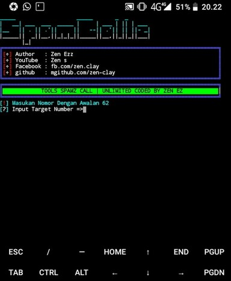

## instaling

```
$ pkg install git
$ pkg install python3
$ pip2 install mechanize
$ pip2 install requests
$ git clone https://github.com/Zen-Clay/spamcallz.git
$ cd spamcallz
$ python3 SpamCallz.py
```

## In Tools



## Ask Me On

* [YouTube](https://www.youtube.com/channel/UCopf7XF5D5hVyx2TePHl-pw)
* [Facebook](https://www.facebook.com/fatahul.ulum.1)
* [Instagram](https://www.instagram.com/aditiastrom)
